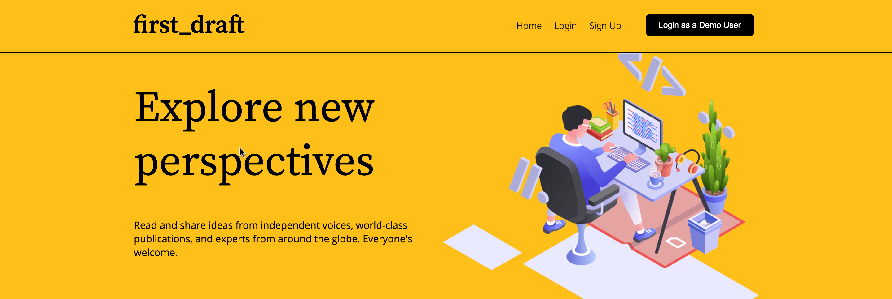
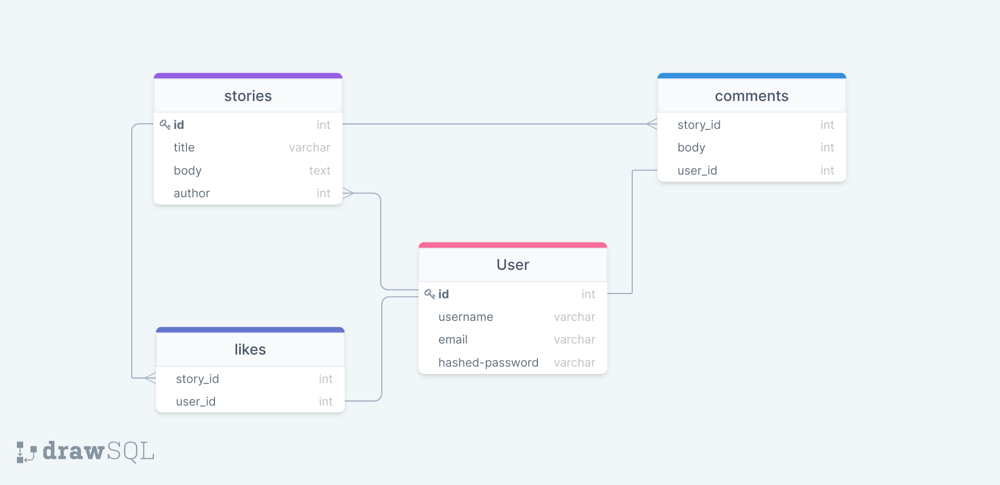
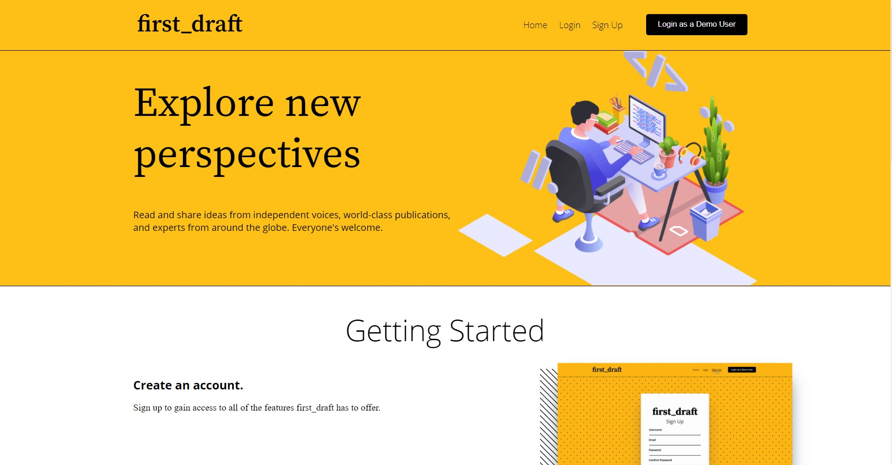
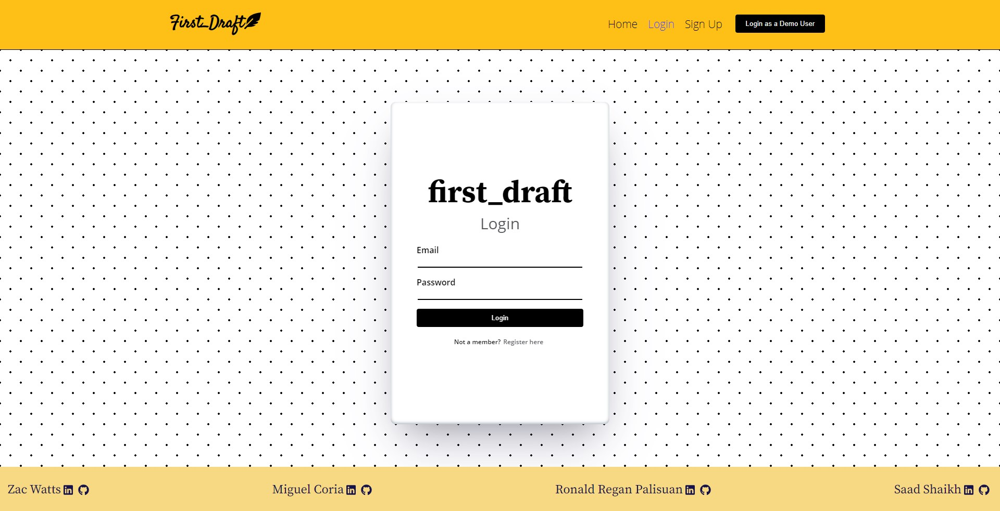
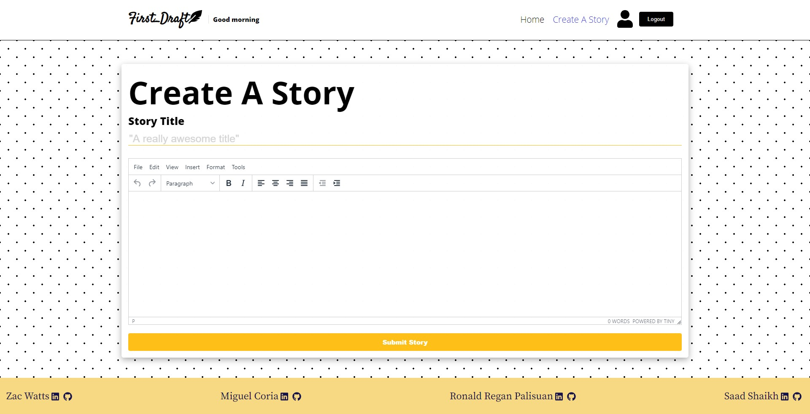
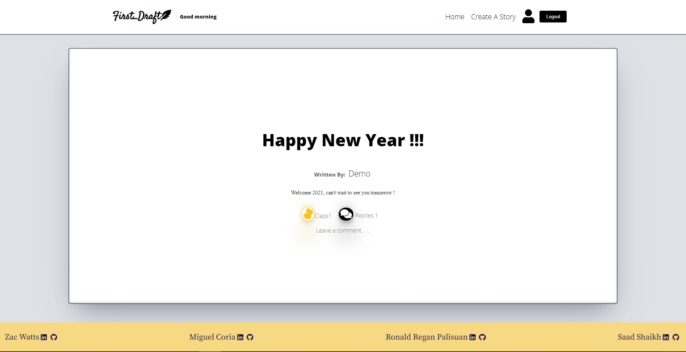
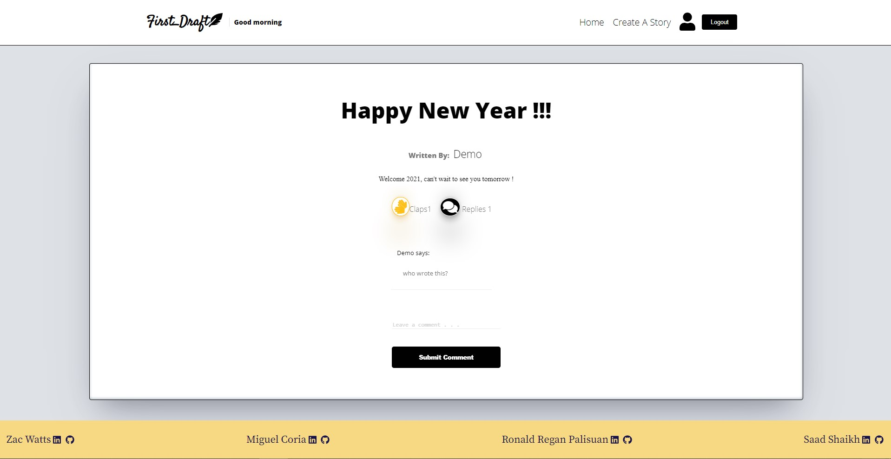
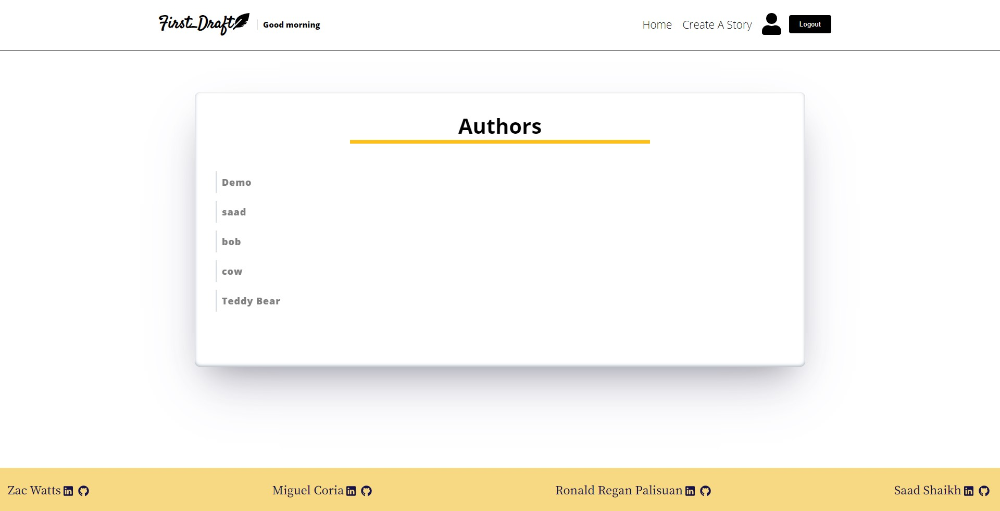
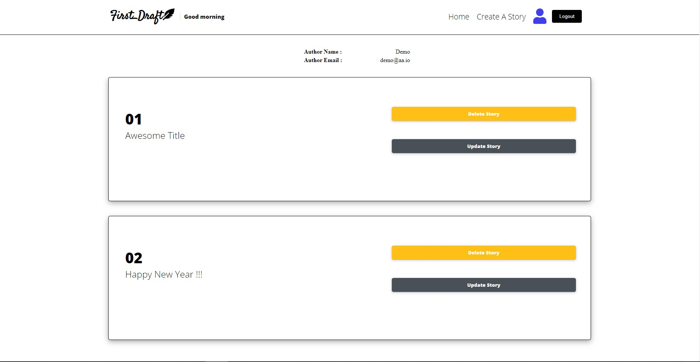
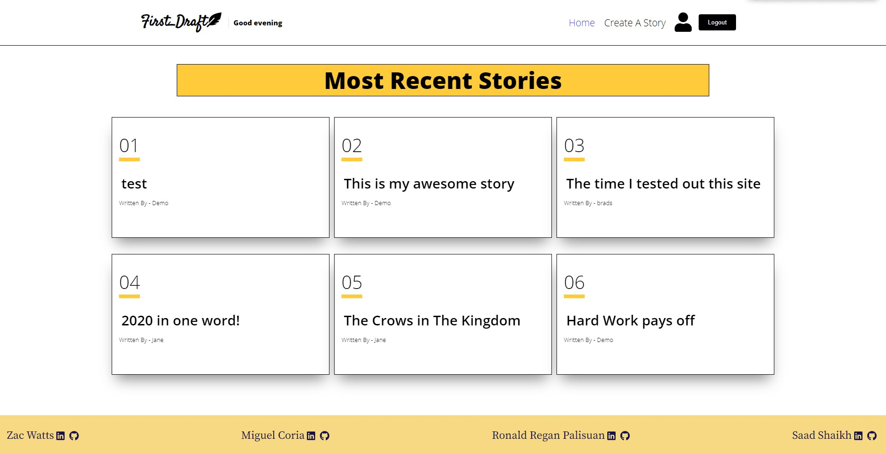

<h1 align="center">
  
  <br>
  Documentation
</h1>
<h1 align="center">
  
  
  
  
</h1>

<h1 align="center">
  Overview
</h1>
<h4>
first_draft is a web app that allows user to create an account to create stories and share their thoughts.
</h4>

---

<h1 align="center" >
 
</h1>

<h4 align="center">'first_draft' is a web app inspired by 'Medium' that allows users to share thoughts, stories, and experience. A logged in users have the ability to create stories, giving comments, likes, & follows.
<pFirst_draft is built with React, Flask, Python and PostgreSQL, SQLAlchemy/></h4>

---

<h1>Database Schema</h1>

 

---

<h1>Features</h1>

<h3 align='left'>

- Login
- Story
- Comment
- Like
- Follow

</h3>

---

<h3>Follow</h3>

```py

```

---

<h1>Endpoint Screenshots</h1>

<h3 align='left'>'/'</h3>



---

<h3>Login</h3>
<h3 align='left'>'/login'</h3>



<h4 align='left'>

```py

@auth_routes.route('/login', methods=['POST'])
def login():
    """
    Logs a user in
    """
    form = LoginForm()
    print(request.get_json())
    # Get the csrf_token from the request cookie and put it into the
    # form manually to validate_on_submit can be used
    form['csrf_token'].data = request.cookies['csrf_token']
    if form.validate_on_submit():
        # Add the user to the session, we are logged in!
        user = User.query.filter(User.email == form.data['email']).first()
        login_user(user)
        return user.to_dict()
    return {'errors': validation_errors_to_error_messages(form.errors)}, 401


```

---

<h3 align='left'>'/signup'</h3>


---

<h3>Story</h3>
<h3 align='left'>'/stories'</h3>



<h4 align='left'>

```js
useEffect(() => {
	document.title = "first_draft: Story";
	(async () => {
		const data = await axios.get(`/api/stories/${id}`);
		data.data.story.length > 0 && setStory(data.data.story[0]);
		data.data.story.length > 0 && setAuthor(data.data.author[0].username);
		data.data.comments.length > 0 && setComments(data.data.comments);

		const response = await authenticate();
		const loggedUser = response.username;
		setCurrentUser(loggedUser);
		setTotalLikes(data.data.total_likes);
	})();
}, [authenticate, id]);
```

---

<h3 align='left'>'/stories/<:id>'</h3>



---

<h3>Comment</h3>
<h3 align='left'>'/stories/<:id>' for comments toggle</h3>



<h4 align='left'>

```js

function Comment({ storyId, setComments, currentUser }) {
	const [comment, setComment] = useState("");
	const history = useHistory();

	const handleSubmit = async (e) => {
		e.preventDefault();
		setComment("");

		const response = await fetch(`/api/stories/${storyId}/comment`, {
			method: "POST",
			headers: {
				"Content-Type": "application/json",
			},
			body: JSON.stringify({
				comment,
				author: currentUser,
			}),
		});
		if (response.ok) {
			const data = await response.json();
			const storyId = data.story_id;
			history.push(`/stories/${storyId}`);
		}
		const data = await axios.get(`/api/stories/${storyId}`);
		const newComments = data.data.comments;
		newComments.length > 0 && setComments(newComments);
	};

```

---

<h3>Like</h3>

<h4 align='left'>

```py

@story_routes.route('/<int:id>/like', methods=['POST'])
def post_like(id):
    story_id = Story.query.get(id).id
    user_id = User.query.filter_by(username = request.json['user']).first().id
    like = Like.query.filter(Like.story_id == id).filter(Like.user_id == user_id).first()
    # count = 1
    if like:
        like.count = like.count + 1
        db.session.add(like)
        db.session.commit()
        return like.to_dict()
    else:
        new_like = Like(user_id, story_id, count=1)
        db.session.add(new_like)
        db.session.commit()
        return new_like.to_dict()

```

---

<h3 align='left'>'/users'</h3>



---

<h3 align='left'>'/users/<:id>'</h3>



---

---

<h3 align='left'>'/' for most recent stories</h3>



